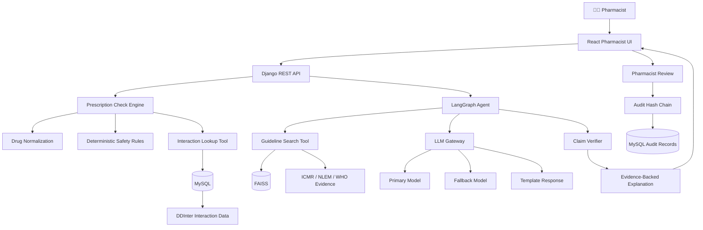

# 🧠 Core Architecture

```mermaid
flowchart TD

    A[👨‍⚕️ Pharmacist] --> B[React Pharmacist UI]

    B --> C[Django REST API]

    C --> D[Prescription Check Engine]

    D --> E[Drug Normalization]
    D --> F[Deterministic Safety Rules]
    D --> G[Interaction Lookup Tool]

    G --> H[(MySQL)]
    H --> I[DDInter Interaction Data]

    C --> J[LangGraph Agent]

    J --> K[Guideline Search Tool]
    K --> L[(FAISS)]
    K --> M[ICMR / NLEM / WHO Evidence]

    J --> N[LLM Gateway]
    N --> O[Primary Model]
    N --> P[Fallback Model]
    N --> Q[Template Response]

    J --> R[Claim Verifier]

    R --> S[Evidence-Backed Explanation]

    S --> B

    B --> T[Pharmacist Review]

    T --> U[Audit Hash Chain]
    U --> V[(MySQL Audit Records)]
```