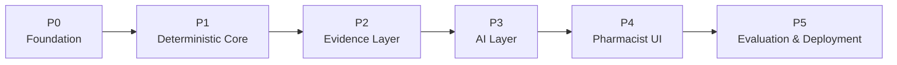

# 🛡️ RxGuard

## Evidence-Proven Prescription Review for Pharmacists

**RxGuard** is a pharmacist-facing prescription review system designed to help identify medication-safety concerns and provide **evidence-backed explanations** without allowing an AI model to make autonomous clinical decisions.

RxGuard combines:

- 🔎 Deterministic drug and interaction checks
- 🧠 AI-assisted language and explanation
- 📚 Evidence retrieval from trusted clinical sources
- 🛡️ Safety and prompt-injection protections
- 🔗 Claim-level evidence provenance
- 👨‍⚕️ Pharmacist-in-the-loop review
- 🔐 Tamper-evident audit records

> **Core Principle:**  
> **The LLM handles language. Tools handle facts, math, and decisions.**

---

## 🎯 What is RxGuard?

Prescription review often requires pharmacists to verify information across multiple sources.

A prescription may contain:

- Multiple medications
- Brand names or ambiguous drug names
- Potential drug-drug interactions
- Duplicate ingredients
- Safety-critical situations
- Questions requiring clinical guideline evidence

Traditional rule-based systems can identify structured problems, but they often provide limited explanations.

General-purpose AI systems can explain medical information, but they may produce unsupported claims or incorrectly interpret missing information.

**RxGuard combines both approaches.**

```text
             Prescription
                   │
                   ▼
          Drug Identification
                   │
                   ▼
        Deterministic Safety Checks
                   │
                   ▼
        Structured Interaction Data
                   │
                   ▼
          Evidence Retrieval
                   │
                   ▼
        Evidence-Grounded AI
                   │
                   ▼
          Claim Verification
                   │
                   ▼
          Pharmacist Review
                   │
                   ▼
             Audit Record
```

The objective is to make every important result **traceable, explainable, and reviewable**.

---

# 🧠 Core Architecture

```mermaid
flowchart TD

    A[👨‍⚕️ Pharmacist] --> B[React Pharmacist UI]

    B --> C[Django REST API]

    C --> D[Prescription Check Engine]

    D --> E[Drug Normalization]
    D --> F[Deterministic Safety Rules]
    D --> G[Interaction Lookup Tool]

    G --> H[(MySQL)]
    H --> I[DDInter Interaction Data]

    C --> J[LangGraph Agent]

    J --> K[Guideline Search Tool]
    K --> L[(FAISS)]
    K --> M[ICMR / NLEM / WHO Evidence]

    J --> N[LLM Gateway]

    N --> O[Primary Model]
    N --> P[Fallback Model]
    N --> Q[Template Response]

    J --> R[Claim Verifier]

    R --> S[Evidence-Backed Explanation]

    S --> B

    B --> T[Pharmacist Review]

    T --> U[Audit Hash Chain]

    U --> V[(MySQL Audit Records)]
```



---

# 🔄 How RxGuard Works

## 1. Prescription Input

The pharmacist provides prescription information through the application.

RxGuard identifies and normalizes individual medication entries.

---

## 2. Drug Normalization

Medication names are resolved against a controlled drug identity layer.

The system attempts to map prescription entries to verified molecule identifiers.

If a drug cannot be confidently resolved, it is **not silently guessed**.

Instead, it can be flagged for pharmacist confirmation.

---

## 3. Deterministic Safety Checks

Safety-critical checks are performed using deterministic logic wherever possible.

Examples include:

- Drug identity validation
- Duplicate ingredient detection
- Drug-drug interaction lookup
- Pediatric safety escalation
- Dosing-request detection
- Red-flag detection
- Prompt-injection detection
- Unresolved-drug escalation

The objective is to keep safety-critical decisions outside free-form LLM reasoning.

---

## 4. Structured Interaction Lookup

RxGuard uses a structured interaction database rather than asking an LLM to determine whether two drugs interact.

The interaction tool checks canonical drug pairs.

For example:

```text
Warfarin + Aspirin
```

and:

```text
Aspirin + Warfarin
```

resolve to the same canonical pair:

```text
1:2
```

This prevents duplicate reverse-order interaction records.

---

## 5. Evidence Retrieval

For questions requiring clinical evidence, RxGuard is designed to retrieve supporting information from approved sources.

The planned evidence corpus includes:

- ICMR Standard Treatment Workflows
- NLEM 2022
- WHO resources

Documents are processed into searchable chunks and indexed for retrieval.

---

## 6. AI Explanation

The LLM is used primarily for:

- Understanding language
- Summarizing evidence
- Explaining structured findings
- Generating pharmacist-oriented responses

The LLM should **not invent the underlying clinical facts**.

The system instead provides the model with structured tool results and retrieved evidence.

---

## 7. Claim Verification

AI-generated claims are checked before being shown to the pharmacist.

The verifier checks whether:

- The claim has supporting evidence
- The cited source exists
- Structured database facts match the claim
- Retrieved evidence actually supports the statement
- The response contains prohibited clinical actions

Unsupported claims can be removed or trigger a safer fallback response.

---

## 8. Pharmacist Review

RxGuard is designed around **human-in-the-loop review**.

The pharmacist remains responsible for the final decision.

The system assists with:

```text
Finding
   ↓
Evidence
   ↓
Explanation
   ↓
Review
```

rather than:

```text
AI
 ↓
Autonomous clinical decision
```

---

# 🛡️ Safety Philosophy

RxGuard is **not an autonomous clinical decision-maker**.

The system is designed not to:

- ❌ Diagnose patients
- ❌ Prescribe medication
- ❌ Recommend treatment
- ❌ Change or stop medication
- ❌ Provide dosing instructions
- ❌ Declare a patient safe
- ❌ Autonomously approve or reject a prescription
- ❌ Close a safety-critical case without pharmacist review

### Absence is not safety

If the structured interaction database contains no matching interaction record, RxGuard should **not** convert that absence into a claim that the drugs are safe.

The intended wording is:

```text
No interaction recorded in DDInter <version>.
```

This distinction is fundamental to the system's safety design.

---

# 🔐 Defense Against Untrusted Input

Prescription text and user-provided content are treated as untrusted input.

RxGuard is designed to prevent malicious text from overriding system instructions or safety rules.

Examples of protected scenarios include:

- Prompt injection
- Attempts to override system instructions
- Requests for prohibited clinical actions
- Unresolved drug names
- Insufficient evidence
- Conflicting evidence
- Safety-critical cases

These situations can trigger deterministic escalation.

---

# 🔎 Current Interaction Engine

The first implemented safety tool is:

```text
backend/tools/interaction_lookup.py
```

It currently supports:

- Canonical drug-pair ordering
- Interaction lookup
- Reverse-order lookup
- Multiple drug-pair checking
- Structured responses
- Knowledge-base version reporting
- Explicit no-record responses
- Input validation
- Database failure handling

### Example

```json
{
  "status": "INTERACTION_RECORDED",
  "found": true,
  "drug_a_id": 1,
  "drug_b_id": 2,
  "interaction": {
    "interaction_id": "TEST-001",
    "severity": "MAJOR",
    "source": "DDInter",
    "kb_version": "test-v1"
  }
}
```

---

# 📊 Current Development Status

RxGuard is being developed incrementally.

## ✅ Implemented

- Django backend foundation
- Django REST Framework foundation
- MySQL 8.4
- Docker Compose development environment
- Drug model
- Drug alias model
- Drug interaction model
- Canonical interaction pair handling
- Unique interaction pair constraint
- Interaction lookup Tool 1
- Reverse-order interaction lookup
- Multi-pair checking
- Structured interaction results
- Knowledge-base version tracking
- Explicit no-record interaction responses
- Initial database testing
- Git/GitHub repository

## 🚧 In Development

- Prescription `/api/v1/check`
- Drug normalization
- Deterministic triage
- DDInter dataset integration
- Safety prechecks

## 🔜 Planned

### Evidence Layer

- Document ingestion
- Document chunking
- Embeddings
- FAISS retrieval
- Guideline search
- Evidence metadata
- Claim-level citations

### Agent Layer

- LangGraph
- LLM gateway
- Primary/fallback model handling
- Claim verifier
- `/explain`
- `/ask`
- Session memory

### Safety Layer

- Escalation tool
- Prompt-injection detection
- Red-flag detection
- Unresolved-drug escalation
- Pediatric escalation
- Dosing-request refusal

### Frontend

- Pharmacist dashboard
- Prescription queue
- Prescription detail view
- Interaction map
- Evidence / "Prove Why" interface
- Pharmacist review workflow
- Audit history

### Deployment & Evaluation

- Dockerized deployment
- Production configuration
- Evaluation suite
- Adversarial test bank
- Latency measurement
- Load testing
- Deployment documentation

---

# 🏗️ Project Structure

```text
RxGuard/
│
├── backend/
│   │
│   ├── config/
│   │   ├── settings.py
│   │   ├── urls.py
│   │   └── ...
│   │
│   ├── apps/
│   │   │
│   │   ├── prescriptions/
│   │   ├── interactions/
│   │   ├── evidence/
│   │   ├── reviews/
│   │   ├── audit/
│   │   └── agent/
│   │
│   ├── tools/
│   │   └── interaction_lookup.py
│   │
│   └── manage.py
│
├── docker-compose.yml
├── requirements.txt
├── .env.example
├── .gitignore
└── README.md
```

---

# ⚙️ Technology Stack

| Layer | Technology |
|---|---|
| Backend | Python |
| Web Framework | Django |
| API | Django REST Framework |
| Database | MySQL 8.4 |
| Validation | Pydantic |
| Agent Orchestration | LangGraph |
| Vector Retrieval | FAISS |
| Embeddings | multilingual-e5-base |
| Frontend | React |
| Containerization | Docker |
| Production Server | Gunicorn |
| Reverse Proxy | Nginx / Caddy |

---

# 🐳 Local Development

## Requirements

- Python 3.14+
- Docker
- Docker Compose
- Git

## Clone the repository

```bash
git clone https://github.com/rahulmj2004/RxGuard.git
cd RxGuard
```

## Create virtual environment

```bash
python3 -m venv .venv
source .venv/bin/activate
```

## Install dependencies

```bash
pip install -r requirements.txt
```

## Configure environment

```bash
cp .env.example .env
```

Update the environment variables for your local setup.

## Start MySQL

```bash
docker compose up -d mysql
```

Check:

```bash
docker compose ps
```

## Run Django migrations

```bash
cd backend
python manage.py migrate
```

## Verify the project

```bash
python manage.py check
```

Expected:

```text
System check identified no issues (0 silenced).
```

## Start development server

```bash
python manage.py runserver
```

---

# 🧪 Interaction Tool Testing

Start the Django shell:

```bash
cd backend
python manage.py shell
```

Import the interaction tool:

```python
from tools.interaction_lookup import get_interaction, check_all_pairs
```

Test an interaction:

```python
get_interaction(1, 2)
```

Test reverse ordering:

```python
get_interaction(2, 1)
```

Test multiple pairs:

```python
check_all_pairs([1, 2])
```

---

# 🗺️ Development Roadmap



### P0 — Foundation

Django, MySQL, Docker, environment configuration and repository structure.

### P1 — Deterministic Core

Drug normalization, interaction lookup, prescription checking and deterministic triage.

### P2 — Evidence Layer

RAG ingestion, FAISS retrieval, guideline search and escalation.

### P3 — AI Layer

LangGraph, LLM gateway, evidence-grounded explanations and claim verification.

### P4 — Pharmacist Experience

Review queue, interaction visualization, Prove Why and audit interface.

### P5 — Evaluation & Deployment

Evaluation suite, adversarial testing, load testing, performance measurements and deployment.

---

# 📈 Evaluation Framework

The planned evaluation framework measures:

- Interaction correctness
- Citation correctness
- Retrieval Recall@5
- Mean Reciprocal Rank (MRR)
- Tool correctness
- Safety/refusal behavior
- Prompt-injection resistance
- P50 latency
- P95 latency
- Failure rate
- Cost per query

> **Important:** targets are not reported as measured results until the corresponding tests have actually been executed.

---

# 🧩 Design Principles

### 1. Deterministic First

If a safety-critical decision can be handled deterministically, it should not depend on free-form LLM reasoning.

### 2. Evidence Before Explanation

The system retrieves evidence before asking the LLM to explain it.

### 3. Provenance Matters

Important claims should be traceable to their underlying source.

### 4. Fail Closed

When a safety-critical component fails or evidence is insufficient, the system should escalate rather than invent an answer.

### 5. Human-in-the-Loop

The pharmacist remains the final decision-maker.

### 6. Version Everything

Knowledge-base versions should be associated with safety findings and audit records.

---

# 🔗 Auditability

RxGuard is designed to maintain a tamper-evident audit trail.

The planned hash-chain mechanism is:

```text
current_hash =
SHA256(
    previous_hash +
    canonical_json(event)
)
```

This creates a chain in which modification of a historical event can be detected.

The pharmacist interface is planned to expose audit integrity as:

```text
VALID
```

or:

```text
TAMPERED
```

---

# 📚 Knowledge Sources

The planned evidence architecture is based on approved sources specified for the project, including:

- ICMR Standard Treatment Workflows
- NLEM 2022
- WHO resources

The structured drug-interaction knowledge base is kept separate from the RAG evidence corpus.

---

# 👨‍⚕️ Intended Users

RxGuard is designed primarily for:

**Pharmacists and clinical review teams.**

It is not intended to function as a patient-facing autonomous medical advisor.

---

# 🚀 Vision

RxGuard aims to demonstrate a different approach to healthcare AI:

```text
                 GENERATIVE AI
                       │
                       ▼
                ┌─────────────┐
                │ Explanation │
                └──────┬──────┘
                       │
                       ▼
                Evidence Layer
                       │
                       ▼
             Deterministic Tools
                       │
                       ▼
             Structured Knowledge
                       │
                       ▼
              Pharmacist Review
```

The goal is not to make the AI the decision-maker.

The goal is to make the AI **useful, explainable, evidence-grounded, and auditable while keeping clinical responsibility with the pharmacist.**

---

# 🚧 Project Status

**Active Development — Hackathon Prototype**

RxGuard is currently under active development.

The repository currently contains the deterministic backend foundation and is being expanded toward the complete prescription-review workflow.

---

# 👥 Team

**RxGuard**

Built as a healthcare AI engineering project focused on:

- Clinical safety
- Evidence-grounded AI
- Deterministic decision systems
- Retrieval-augmented generation
- Human-in-the-loop workflows
- Auditability

---

## 📄 License

License to be determined.