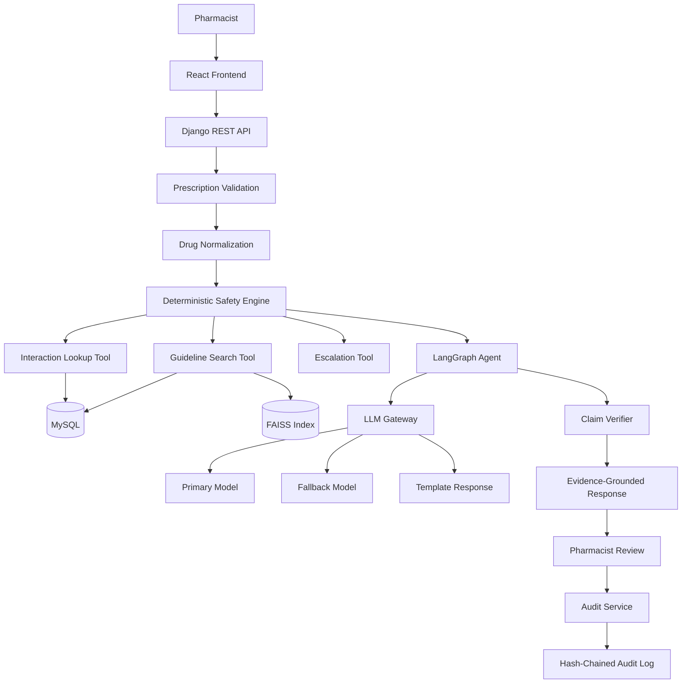

# RxGuard

## Evidence-Proven Prescription Review for Pharmacists

RxGuard is a pharmacist-facing prescription review system designed to identify medication-safety concerns and provide evidence-backed explanations while keeping the final clinical decision with the pharmacist.

RxGuard combines deterministic safety checks, structured drug-interaction data, clinical evidence retrieval, AI-assisted explanations, claim verification, and pharmacist review into a single workflow.

---

## Core Principle

> The LLM handles language. Tools handle facts, math, and decisions.

RxGuard does not rely on an LLM alone for medication-safety decisions.

Structured databases and deterministic tools handle factual checks. Retrieval tools provide supporting clinical evidence. The LLM is used primarily for language understanding and explanation.

---

## Problem

Prescription review can require pharmacists to manually verify information across multiple sources.

A prescription may contain:

- Multiple medications
- Brand names or ambiguous drug names
- Potential drug-drug interactions
- Duplicate active ingredients
- Safety-critical situations
- Questions requiring clinical guideline evidence

Traditional rule-based systems can identify structured problems but may provide limited explanations.

General-purpose AI systems can explain medical information but may generate unsupported claims, misinterpret missing information, or provide inappropriate clinical recommendations.

RxGuard combines deterministic verification with evidence-grounded AI while maintaining pharmacist oversight.

---

## Solution

RxGuard follows a deterministic-first architecture.

```text
Prescription
     |
     v
Drug Identification
     |
     v
Deterministic Safety Checks
     |
     v
Structured Interaction Lookup
     |
     v
Clinical Evidence Retrieval
     |
     v
AI Explanation
     |
     v
Claim Verification
     |
     v
Pharmacist Review
     |
     v
Tamper-Evident Audit
```

The system is designed so that every important safety-related claim can be traced back to structured data or supporting evidence.

---
## Architecture

RxGuard follows a deterministic-first architecture in which structured tools handle factual and safety-critical operations while the LLM is responsible for language understanding and explanation.



### Core Components

| Component | Responsibility |
|---|---|
| React Frontend | Prescription review interface and pharmacist workflow |
| Django REST API | Backend API and orchestration layer |
| Drug Normalizer | Resolves prescription text to canonical drug identities |
| Safety Engine | Performs deterministic safety checks and triage |
| Interaction Lookup | Checks structured drug-drug interaction data |
| Guideline Search | Retrieves supporting clinical evidence |
| Escalation Tool | Creates deterministic escalation records |
| LangGraph Agent | Controls follow-up reasoning and tool usage |
| LLM Gateway | Handles primary, fallback, and template responses |
| Claim Verifier | Validates AI-generated claims against available evidence |
| MySQL | Stores structured data, sessions, evidence metadata, and audit records |
| FAISS | Performs vector-based clinical evidence retrieval |
| Audit Service | Maintains tamper-evident review history |


## Key Features

### Deterministic Drug Interaction Checking

Prescription drug pairs are checked against a structured and versioned interaction database.

The system evaluates all relevant drug pairs rather than relying on an LLM to determine whether an interaction exists.

### Drug Normalization

RxGuard resolves prescription entries to canonical drug identities using:

- Exact alias matching
- Longest-match resolution
- Fuzzy matching
- Candidate generation
- Controlled LLM-assisted selection
- Pharmacist confirmation for unresolved cases

The LLM is not allowed to invent a drug identity.

### Duplicate Ingredient Detection

The system detects duplicate active ingredients
## Implementation Roadmap

RxGuard is being developed incrementally through defined implementation phases.

### P0 — Foundation

**Objective:** Establish a reliable development and infrastructure foundation.

Tasks:

- Verify datasets and licensing
- Initialize repository structure
- Configure Django
- Configure MySQL
- Configure Docker Compose
- Configure environment variables
- Add correlation IDs and basic logging
- Verify local development environment

**Definition of Done:**

```text
Stack boots successfully
Django connects to MySQL
Environment configuration works
Initial application structure is operational
```

---

### P1 — Deterministic Safety Core

**Objective:** Build the core prescription checking pipeline without relying on an LLM.

Tasks:

- Create drug and alias models
- Implement drug normalization
- Implement canonical drug resolution
- Implement structured interaction lookup
- Check all drug pairs
- Detect duplicate ingredients
- Implement deterministic triage
- Implement `/api/v1/check`
- Validate API input and output
- Add initial evaluation cases E1–E10

**Definition of Done:**

```text
Prescription
    |
    v
Drug Resolution
    |
    v
Interaction Lookup
    |
    v
Duplicate Detection
    |
    v
Deterministic Triage
    |
    v
Structured Review Result
```

---

### P2 — Evidence and Safety Layer

**Objective:** Add clinical evidence retrieval and deterministic escalation.

Tasks:

- Ingest approved clinical documents
- Process documents using Docling
- Clean and normalize source documents
- Create structured chunks
- Generate embeddings
- Build FAISS index
- Store evidence metadata in MySQL
- Implement guideline search
- Implement MySQL fallback search
- Implement escalation tool
- Add safety prechecks
- Add prompt-injection detection
- Add red-flag handling
- Add evaluation cases E11–E13 and E17–E20

**Definition of Done:**

```text
Structured Facts
      +
Clinical Evidence
      +
Safety Escalation
      |
      v
Evidence-Backed Review
```

---

### P3 — Agent and Verification Layer

**Objective:** Introduce controlled AI reasoning while keeping factual decisions outside the LLM.

Tasks:

- Implement LangGraph workflow
- Implement LLM gateway
- Add primary model
- Add fallback model
- Add template fallback
- Define structured AI output schemas
- Add Pydantic validation
- Implement claim-level verification
- Implement `/explain`
- Implement `/ask`
- Add session memory
- Enforce tool-call limits
- Filter unsupported claims
- Run the complete evaluation suite

**Core principle:**

```text
LLM generates language.
Tools provide facts.
Verifier checks claims.
Pharmacist makes the final decision.
```

---

### P4 — Pharmacist Interface

**Objective:** Build the complete pharmacist-facing workflow.

Tasks:

- Implement React frontend
- Prescription input interface
- Review queue
- Prescription detail view
- Drug resolution interface
- Interaction map
- Evidence and citation view
- "Prove Why" evidence interface
- Pharmacist review workflow
- Escalation display
- Audit history interface

**Target workflow:**

```text
Prescription
      |
      v
Review Queue
      |
      v
Prescription Details
      |
      v
Drug Resolution
      |
      v
Safety Findings
      |
      v
Evidence / Prove Why
      |
      v
Pharmacist Decision
      |
      v
Audit Record
```

---

### P5 — Evaluation and Production Readiness

**Objective:** Validate reliability, performance, security, and deployment readiness.

Tasks:

- Run E1–E20 evaluation suite
- Measure interaction correctness
- Measure citation correctness
- Measure retrieval Recall@5 and MRR
- Measure tool correctness
- Measure safety/refusal behavior
- Test prompt-injection resistance
- Measure latency
- Measure P50 latency
- Measure P95 latency
- Measure failure rate
- Measure cost per query
- Perform load testing
- Add structured JSON logging
- Add correlation IDs
- Add production Django configuration
- Add HTTPS deployment
- Complete `EVAL_REPORT.md`
- Complete architecture documentation

**Definition of Done:**

```text
Functional Validation
        +
Safety Validation
        +
Retrieval Evaluation
        +
Performance Testing
        +
Security Testing
        +
Deployment Validation
        |
        v
Production-Ready MVP
```

---

### P6 — Stretch Features

Potential future improvements include:

- Human-in-the-loop approval workflows
- Advanced load testing
- Prompt versioning
- Regional language support
- Malayalam support
- Hindi support
- Additional evidence sources
- Extended monitoring and observability
## Project Status

| Phase | Status | Focus |
|---|---|---|
| P0 | In Progress | Infrastructure and development foundation |
| P1 | In Progress | Deterministic prescription safety core |
| P2 | Planned | Evidence retrieval and escalation |
| P3 | Planned | Agent, LLM gateway, and claim verification |
| P4 | Planned | Pharmacist frontend and review workflow |
| P5 | Planned | Evaluation, performance, and deployment |
| P6 | Planned | Stretch features |

Implementation status is updated as development progresses.
## Technology Stack

### Backend
- Python
- Django
- Django REST Framework
- Pydantic

### AI and Agent
- LangGraph
- LLM Gateway
- Claim Verification

### Data
- MySQL
- DDInter
- NLEM 2022
- ICMR Standard Treatment Workflows
- WHO clinical sources

### Retrieval
- FAISS
- Multilingual E5 embeddings
- MySQL FULLTEXT fallback

### Frontend
- React

### Infrastructure
- Docker
- Docker Compose
- Caddy or Nginx
- GitHub